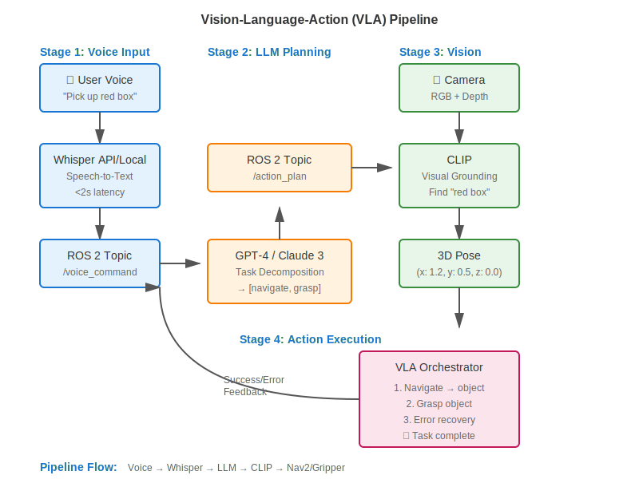

# Chapter 4.1: Introduction to Vision-Language-Action

## What You'll Learn

By the end of this chapter, you will:
- Understand the Vision-Language-Action (VLA) paradigm and why it's transformative for robotics
- Recognize real-world VLA applications in humanoid robots and autonomous systems
- Map out the complete VLA pipeline you'll build in this module
- Review prerequisites and prepare for hands-on implementation

**Estimated Time**: 1 hour

---

## The Vision-Language-Action Paradigm

### What is VLA?

**Vision-Language-Action (VLA)** is an AI paradigm that enables robots to:
1. **Perceive** their environment through vision (cameras, depth sensors)
2. **Understand** natural language commands from humans (voice or text)
3. **Reason** about tasks using large language models (LLMs)
4. **Execute** physical actions in the real world (navigation, manipulation)

Unlike traditional robotics where every behavior is explicitly programmed, VLA robots can **interpret open-ended commands** and **adapt to new situations** by leveraging the common-sense reasoning capabilities of LLMs.

### The Three Pillars of VLA

```
┌─────────────────────────────────────────────────────────────┐
│                      VLA PARADIGM                           │
├─────────────┬─────────────────┬──────────────────────────────┤
│   VISION    │    LANGUAGE     │         ACTION               │
│             │                 │                              │
│ • Cameras   │ • Speech-to-    │ • Navigation (Nav2)          │
│ • Depth     │   Text (Whisper)│ • Manipulation (Gripper)     │
│ • CLIP      │ • LLM Planning  │ • Task Execution             │
│ • Object    │   (GPT-4/Claude)│ • Error Recovery             │
│   Detection │ • Grounding     │                              │
└─────────────┴─────────────────┴──────────────────────────────┘
```

**Vision**: Robots see their environment using cameras (RGB + depth) and vision models like CLIP to identify objects.

**Language**: Robots understand human intent through speech-to-text (Whisper) and LLM-based reasoning (GPT-4 or Claude) to decompose tasks.

**Action**: Robots execute plans using ROS 2 navigation (Nav2) and manipulation primitives (grasp, place, navigate).

---

## Why VLA Matters: The Shift from Programming to Prompting

### Traditional Robotics (Pre-VLA)

```python
# Traditional: Explicit programming for every scenario
if command == "fetch_coffee":
    navigate_to(x=5.2, y=3.1, z=0.0)  # Hardcoded position
    grasp_object(object_id=7)         # Hardcoded object ID
    navigate_to(x=0.0, y=0.0, z=0.0)  # Return to origin
elif command == "fetch_wrench":
    navigate_to(x=8.5, y=1.2, z=0.0)  # Different hardcoded position
    grasp_object(object_id=12)
    # ... and so on for every possible command
```

**Problems**:
- ❌ Every command requires explicit code
- ❌ Cannot handle variations ("Bring me the *blue* cup")
- ❌ No adaptability to new objects or environments
- ❌ Thousands of lines of code for basic tasks

### VLA Robotics (Modern)

```python
# VLA: Natural language commands, LLM reasoning
user_command = "Bring me the blue cup from the kitchen table"

# 1. Voice → Text (Whisper)
transcript = whisper.transcribe(audio)  # "Bring me the blue cup..."

# 2. Language → Plan (GPT-4/Claude)
plan = llm.generate_plan(transcript)
# → [{"action": "navigate", "target": "kitchen table"},
#     {"action": "search", "object": "blue cup"},
#     {"action": "grasp", "object": "blue cup"},
#     {"action": "navigate", "target": "user"},
#     {"action": "place", "location": "hand"}]

# 3. Vision → Locate (CLIP)
object_pose = clip.find_object("blue cup", camera_image)  # 3D position

# 4. Action → Execute (ROS 2 + Nav2)
for step in plan:
    execute(step, object_pose)
```

**Advantages**:
- ✅ Handles open-ended natural language commands
- ✅ Adapts to new objects (no retraining for "red cup" vs "blue cup")
- ✅ Common-sense reasoning ("kitchen table" implies navigation to kitchen first)
- ✅ Same code handles infinite command variations

---

## Real-World VLA Examples

### 1. Everyday Robots (Google X, 2020-2023)

Google's Everyday Robots project deployed VLA-powered robots in Google offices to perform tasks like:
- Cleaning tables and sorting trash
- Opening doors and fetching items
- Adapting to new environments through LLM-guided exploration

**Key Technology**: RT-1 and RT-2 (end-to-end neural VLA policies trained on 130,000+ robot demonstrations)

**Outcome**: Robots successfully executed 700+ unique tasks with 90%+ success rate in real office environments.

### 2. Tesla Optimus (Humanoid Robot, 2023-Present)

Tesla's Optimus humanoid uses VLA principles for:
- Voice-commanded object manipulation ("Pick up that box")
- Visual grounding to identify target objects in cluttered scenes
- LLM-based task planning for multi-step assembly tasks

**Demo**: Optimus sorting colored blocks by verbal instruction, folding laundry, and navigating warehouse environments.

### 3. Figure 01 (Figure AI, 2024)

Figure AI's humanoid robot integrated with OpenAI's multimodal GPT-4V for:
- Visual question answering ("What do you see?")
- Natural language interaction ("Hand me the apple")
- Real-time task reasoning and execution

**Demonstration**: Robot conversed with humans while performing fetch-and-deliver tasks in a kitchen setting.

### 4. Open-Source VLA: OK-Robot (NYU/Meta, 2024)

Open-source VLA system combining:
- WhisperX for speech
- GPT-4 for planning
- OWL-ViT for visual grounding
- ROS 2 for robot control

**Result**: 58.5% success rate on pick-and-drop tasks in unseen environments (no training on target objects).

---

## The VLA Pipeline You'll Build

In this module, you'll implement a **complete VLA system** for a simulated humanoid robot. Here's the end-to-end workflow:



### Pipeline Stages

#### Stage 1: Voice Input (Chapter 4.2-4.3)
- **User speaks**: "Pick up the red box"
- **Whisper** transcribes audio to text
- **Wake-word detection** filters out background speech
- **Output**: Transcript published to ROS 2 topic `/voice_command`

#### Stage 2: Language Understanding & Planning (Chapter 4.4)
- **LLM** (GPT-4 or Claude) receives transcript
- **Task decomposition**: Breaks command into action primitives
  - `navigate("red box")` → Move to red box location
  - `grasp("red box")` → Pick up red box
- **Output**: Action plan published to `/action_plan` topic

#### Stage 3: Visual Grounding (Chapter 4.5-4.6)
- **CLIP** matches text query "red box" to camera image
- **Bounding box detection**: Locates red box in image (pixel coordinates)
- **3D pose estimation**: Uses depth data to compute 3D position (x, y, z in meters)
- **Output**: Object pose published to TF frame `/detected_object` and `/object_pose` topic

#### Stage 4: Action Execution (Chapter 4.7-4.8)
- **Nav2** navigates robot to detected object location
- **Gripper controller** closes gripper to grasp object
- **State machine** orchestrates multi-step execution
- **Error recovery**: Handles failures (object moved, navigation blocked, etc.)
- **Output**: Task completed, robot returns to home position

### Technologies You'll Use

| Component | Technology | Purpose |
|-----------|-----------|---------|
| **Speech-to-Text** | OpenAI Whisper (API or local) | Convert voice commands to text |
| **Wake-Word** | Picovoice Porcupine | Detect "Hey Robot" to activate listening |
| **LLM Planning** | GPT-4 or Claude 3 | Decompose tasks into action sequences |
| **Visual Grounding** | OpenAI CLIP | Match text to image regions (zero-shot) |
| **3D Perception** | RGB-D Camera + depth | Compute 3D object positions |
| **Navigation** | Nav2 (from Module 3) | Autonomous navigation to targets |
| **Orchestration** | py_trees (behavior trees) | State machine for VLA pipeline |
| **Integration** | ROS 2 Humble | Glue everything together |

---

## Module Roadmap

### Learning Journey 1: Voice-to-Text (Chapters 4.2-4.3) 🎯 Priority 1
**Goal**: Capture voice commands and publish to ROS 2

**What you'll build**:
- WhisperNode: ROS 2 node that transcribes speech
- Wake-word detection: Activate on "Hey Robot"
- Audio preprocessing: Noise reduction, VAD

**Milestone**: Speak "Move forward 2 meters" → Whisper transcribes → Published to `/voice_command` topic with under 2 seconds latency

### Learning Journey 2: LLM Task Planning (Chapter 4.4) 🎯 Priority 1
**Goal**: Convert natural language to structured action plans

**What you'll build**:
- LLMPlannerNode: ROS 2 node calling GPT-4 or Claude
- Prompt engineering: System message, few-shot examples
- Plan validation: Safety checks, action whitelisting

**Milestone**: Command "Pick up the red box" → LLM generates `[{navigate, grasp}]` plan → Published to `/action_plan`

### Learning Journey 3: Visual Grounding (Chapters 4.5-4.6)
**Goal**: Connect language to visual perception

**What you'll build**:
- VisualGroundingNode: CLIP-based object detection
- 3D pose estimation: Depth → 3D coordinates
- TF integration: Publish detected object frames

**Milestone**: Query "red box" + camera image → CLIP detects box → 3D pose published to `/object_pose`

### Learning Journey 4: VLA Pipeline Integration (Chapters 4.7-4.8)
**Goal**: Orchestrate full voice → action workflow with error recovery

**What you'll build**:
- VLAOrchestratorNode: State machine coordinating all nodes
- Error recovery: Handle speech errors, perception failures, navigation blocks
- End-to-end testing: Voice command → autonomous task completion

**Milestone**: Voice "Bring me the wrench" → Full pipeline executes → Robot delivers wrench with recovery from 1+ errors

### Mini-Project (Chapter 4.9)
**Goal**: Complete VLA system for fetch-and-deliver tasks

**What you'll build**:
- Voice-controlled humanoid in simulated home environment
- 5 test scenarios (fetch red mug, find blue book, etc.)
- 80%+ success rate with error recovery

---

## Prerequisites Review

Before starting this module, ensure you have:

### ✅ Completed Modules
- **Module 1**: ROS 2 fundamentals (pub/sub, services, RViz2)
- **Module 2 OR 3**: Simulation environment (Gazebo OR Isaac Sim) with:
  - Robot model (humanoid or mobile manipulator)
  - Camera sensors (RGB + depth recommended)
  - Navigation stack (Nav2 from Module 3)

### ✅ API Keys & Accounts
You'll need **one** of these combinations:

**Option A: OpenAI (Whisper + GPT-4)**
- OpenAI API key: https://platform.openai.com/signup
- Cost: ~$5-10 for full module
- Free tier: $5 credit for new accounts

**Option B: OpenAI + Anthropic (Whisper + Claude)**
- OpenAI API key (for Whisper): https://platform.openai.com/signup
- Anthropic API key (for Claude 3): https://console.anthropic.com/
- Cost: ~$5-10 for full module

:::tip API Keys Setup
See the [API Keys Setup Guide](../partials/api-keys-setup.md) for step-by-step instructions on creating accounts, generating keys, and securing them in `.env` files.
:::

### ✅ Hardware Requirements

**Minimum** (works but slower):
- 16GB RAM, 4-core CPU
- Microphone (any USB mic or laptop mic)
- Internet connection (for API calls)

**Recommended** (smooth experience):
- 32GB RAM, 8-core CPU
- NVIDIA GPU (RTX 2060+, 8GB VRAM) for local Whisper + CLIP
- USB microphone with noise cancellation
- Internet connection

### ✅ Software Setup

Follow these steps to set up your environment:
- Install Python dependencies (`openai`, `anthropic`, `clip`, `sounddevice`, etc.)
- Configure `.env` file with API keys (see API Keys Setup Guide below)
- Test microphone and APIs
- Verify simulation environment

**Estimated setup time**: 30-60 minutes

---

## Hands-On Preview: What You'll Build

By the end of this module, you'll have a fully functional VLA robot that can:

### Example Interaction 1: Simple Fetch Task

```
[User speaks into microphone]
User: "Hey Robot, pick up the wrench."

[VLA Pipeline Executes]
1. Whisper transcribes: "pick up the wrench"
2. GPT-4 plans: [navigate("wrench"), grasp("wrench")]
3. CLIP detects wrench in camera image → (x: 1.2m, y: 0.5m, z: 0.0m)
4. Nav2 navigates to (1.2, 0.5)
5. Gripper grasps object
6. Robot reports: "Task complete"

[Result: Robot successfully picked up wrench]
```

### Example Interaction 2: Complex Multi-Step Task

```
User: "Bring me the blue cup from the kitchen table."

[VLA Pipeline]
1. Whisper: "bring me the blue cup from the kitchen table"
2. LLM: [navigate("kitchen table"), search("blue cup"), grasp("blue cup"),
        navigate("user"), place("hand")]
3. CLIP detects "kitchen table" → navigates there
4. CLIP searches for "blue cup" → detects at (x: 2.1m, y: 1.3m)
5. Robot navigates, grasps, returns to user
6. Robot: "Here is the blue cup"
```

### Example Interaction 3: Error Recovery

```
User: "Get the red box."

[Pipeline with Failure]
1-3. Normal execution (transcribe, plan, navigate)
4. ERROR: Object not detected at expected location
5. Robot: "I don't see the red box. Searching..."
6. Robot rotates 180°, re-runs CLIP detection
7. CLIP detects box at new location → grasps successfully
8. Robot: "Found it! Task complete."
```

---

## Safety & Ethics Considerations

Before building VLA systems, it's critical to understand responsible AI development:

:::warning Important: LLM Safety
Large language models can make mistakes, hallucinate plans, or misinterpret commands. **Always validate LLM outputs** before executing physical actions. See the [LLM Safety Guidelines](../partials/llm-safety-guidelines.md) for best practices.
:::

**Key Safety Principles**:
1. **Human-in-the-Loop**: Confirm high-risk actions before execution
2. **Input Validation**: Whitelist allowed actions, reject unsafe commands
3. **Fail-Safe Defaults**: Stop and ask for help when uncertain
4. **Monitoring & Logging**: Record all commands and actions for accountability
5. **Privacy**: Inform users that voice/camera data is processed by cloud APIs

We'll implement these safeguards throughout the module (especially in Chapters 4.4 and 4.8).

---

## Chapter Summary

In this chapter, you learned:
- ✅ **VLA Definition**: Vision-Language-Action enables robots to perceive, understand, and act based on natural language commands
- ✅ **Why VLA Matters**: Shift from explicit programming to LLM-guided reasoning allows robots to handle open-ended, adaptive tasks
- ✅ **Real-World Examples**: Google Everyday Robots, Tesla Optimus, Figure 01 demonstrate VLA's transformative potential
- ✅ **Pipeline Overview**: Voice → LLM → Vision → Action (Whisper → GPT-4/Claude → CLIP → Nav2)
- ✅ **Module Roadmap**: 4 learning journeys covering voice input, LLM planning, visual grounding, and full pipeline integration
- ✅ **Prerequisites**: Module 1 + (Module 2 OR 3), API keys (OpenAI/Anthropic), microphone, simulation environment

---

## What's Next?

Now that you understand the VLA paradigm and the system you'll build, let's dive into the first component: **speech-to-text with OpenAI Whisper**.

In **Chapter 4.2**, you'll:
- Learn how Whisper's encoder-decoder Transformer achieves state-of-the-art speech recognition
- Compare Whisper API vs local deployment (costs, latency, accuracy)
- Build a WhisperNode that publishes voice commands to ROS 2
- Test real-time transcription with your microphone

**Ready to give your robot a voice interface?** Let's continue! 🚀

---

## Additional Resources

- [OpenAI Whisper Paper (2022)](https://arxiv.org/abs/2212.04356) - Technical details on Whisper architecture
- [RT-2 Paper (Google, 2023)](https://robotics-transformer2.github.io/) - End-to-end VLA with vision-language-action models
- [OK-Robot (Open-Source VLA)](https://ok-robot.github.io/) - Academic VLA system you can reproduce
- [VLA Survey Paper](https://arxiv.org/abs/2307.15818) - Comprehensive review of vision-language-action methods

---

**⏱️ Estimated Chapter Time**: 1 hour (reading + concept review)
**🎯 Next Chapter**: [4.2 Speech-to-Text with Whisper](./chapter-4-2-speech-to-text)
