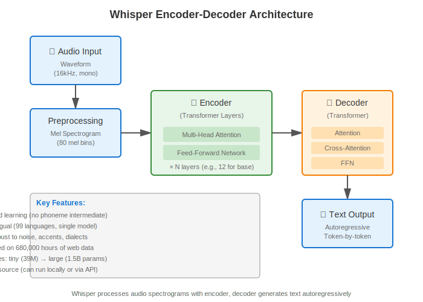

# Chapter 4.2: Speech-to-Text with Whisper

## What You'll Learn

By the end of this chapter, you will:
- Understand automatic speech recognition (ASR) and Whisper's architecture
- Transcribe audio using both Whisper API and local models
- Compare API vs local deployment (costs, latency, accuracy trade-offs)
- Build a ROS 2 WhisperNode that publishes voice commands to `/voice_command` topic
- Implement real-time streaming transcription

**Estimated Time**: 2.5 hours

---

## Introduction: Giving Robots Ears

Voice is the most natural interface for human-robot interaction. Instead of typing commands or pressing buttons, users can simply speak: **"Hey robot, bring me the wrench."**

To enable voice interfaces, robots need **Automatic Speech Recognition (ASR)** — technology that converts spoken language into text. In this chapter, we'll use **OpenAI Whisper**, a state-of-the-art ASR model that's:
- **Robust to accents and noise** (trained on 680,000 hours of multilingual data)
- **Multilingual** (supports 99 languages including English, Spanish, Chinese, Arabic, etc.)
- **Open-source** (can run locally without API calls)
- **Accurate** (achieves near-human performance on clean speech)

---

## ASR Fundamentals: How Speech Recognition Works

### Traditional ASR Pipeline (Pre-Deep Learning)

Classic ASR systems had three separate components:

```
[Audio] → [Acoustic Model] → [Phonemes] → [Language Model] → [Text]
```

1. **Acoustic Model**: Maps audio waveforms to phonemes (basic speech sounds like "k", "ae", "t" for "cat")
2. **Pronunciation Dictionary**: Maps phonemes to words
3. **Language Model**: Predicts likely word sequences ("I saw" is more likely than "eye saw")

**Problems**:
- ❌ Complex pipeline (many parts to train and tune)
- ❌ Struggles with accents, noise, and new words
- ❌ Requires large labeled datasets for each component

### Modern ASR with Deep Learning (Whisper)

Whisper uses an **end-to-end neural network** (encoder-decoder Transformer) that learns directly from audio to text:

```
[Audio Waveform] → [Whisper Encoder-Decoder] → [Text]
```



**Architecture**:
1. **Audio Preprocessing**: Convert audio to mel spectrogram (visual representation of sound frequencies over time)
2. **Encoder**: Transformer that processes spectrogram features
3. **Decoder**: Transformer that generates text tokens autoregressively (one word at a time)

**Advantages**:
- ✅ Single end-to-end model (simpler to train and deploy)
- ✅ Robust to accents, dialects, and background noise
- ✅ Multilingual (single model handles 99 languages)
- ✅ Zero-shot learning (works on new domains without fine-tuning)

**Training Data**: Whisper was trained on 680,000 hours of labeled audio from the web, covering diverse accents, recording conditions, and languages.

---

## Whisper Model Sizes

Whisper comes in 5 sizes, trading off accuracy for speed:

| Model | Parameters | VRAM (GPU) | Accuracy (WER) | Speed (CPU) | Speed (GPU) | Best For |
|-------|-----------|------------|----------------|-------------|-------------|----------|
| **tiny** | 39M | ~1GB | ~10% | ~5s / 30s audio | under 1 second | Quick prototyping, testing |
| **base** | 74M | ~1GB | ~7% | ~10s / 30s audio | ~1-2s | Recommended minimum |
| **small** | 244M | ~2GB | ~5% | ~20s / 30s audio | ~2-3s | Good balance |
| **medium** | 769M | ~5GB | ~4% | ~60s / 30s audio | ~4-5s | Production quality |
| **large** | 1550M | ~10GB | ~3% | ~120s / 30s audio | ~8-10s | Best accuracy (overkill for most) |

**WER (Word Error Rate)**: Percentage of words transcribed incorrectly. Lower is better. Human-level WER is ~5-7%.

**Recommendation**:
- **For learning**: Use `base` or `small` (fast enough, good accuracy)
- **For production**: Use `medium` (best accuracy-speed trade-off)
- **For API**: OpenAI API uses `large-v3` automatically (best quality, no model selection needed)

---

## Approach 1: Whisper API (Cloud-Based)

### Why Use the API?

**Pros**:
- ✅ Zero setup (no model downloads, no GPU required)
- ✅ Always uses latest Whisper model (`large-v3`)
- ✅ Fast (< 2s latency for 30s audio)
- ✅ No compute costs on your end

**Cons**:
- ❌ Requires internet connection
- ❌ Costs ~$0.006 per minute (~$0.36/hour of audio)
- ❌ Data leaves your device (privacy concern for sensitive applications)

**Best For**: Prototyping, low-volume applications, learners without GPUs

### API Pricing

- **Cost**: $0.006 per minute of audio (charged per second, rounded up)
- **Example**:
  - 5-second voice command: $0.0005 (~$0.001 rounded)
  - 1 hour of continuous transcription: $0.36
  - Full Module 4 (~2 hours of audio total): $0.72

**Rate Limits** (as of 2024):
- **Free tier**: 3 requests/minute, 200 requests/day
- **Paid tier**: 50 requests/minute

### Code Example: Basic Whisper API Usage

Create file: `docs/assets/module-4/code/chapter-4-2/whisper_api_basic.py`

```python
"""
Basic Whisper API transcription example
Demonstrates recording audio and sending to OpenAI Whisper API
"""

import openai
import sounddevice as sd
import soundfile as sf
import numpy as np
import os
from dotenv import load_dotenv

# Load environment variables from .env file
load_dotenv()

# Initialize OpenAI client
client = openai.OpenAI(api_key=os.getenv("OPENAI_API_KEY"))

def record_audio(duration=5, sample_rate=16000):
    """
    Record audio from microphone

    Args:
        duration: Recording length in seconds
        sample_rate: Audio sample rate (Whisper expects 16kHz)

    Returns:
        numpy array: Audio data
    """
    print(f"🎤 Recording for {duration} seconds... Speak now!")
    audio = sd.rec(
        int(duration * sample_rate),
        samplerate=sample_rate,
        channels=1,  # Mono audio
        dtype='float32'
    )
    sd.wait()  # Wait for recording to finish
    print("✅ Recording complete!")
    return audio.flatten()

def transcribe_with_api(audio, sample_rate=16000):
    """
    Transcribe audio using Whisper API

    Args:
        audio: numpy array of audio data
        sample_rate: Audio sample rate

    Returns:
        str: Transcribed text
    """
    # Save audio to temporary file (API requires file upload)
    temp_filename = "temp_audio.wav"
    sf.write(temp_filename, audio, sample_rate)

    # Send to Whisper API
    print("🌐 Sending to Whisper API...")
    with open(temp_filename, "rb") as audio_file:
        transcript = client.audio.transcriptions.create(
            model="whisper-1",  # OpenAI's API model (uses large-v3)
            file=audio_file,
            language="en"  # Optional: specify language for faster processing
        )

    # Clean up temporary file
    os.remove(temp_filename)

    return transcript.text

def main():
    """Main function: Record and transcribe"""
    print("=" * 60)
    print("Whisper API Transcription Example")
    print("=" * 60)

    # Check API key
    if not os.getenv("OPENAI_API_KEY"):
        print("❌ ERROR: OPENAI_API_KEY not found in .env file")
        print("   Please add your API key to .env:")
        print("   OPENAI_API_KEY=sk-proj-...")
        return

    # Record audio
    audio = record_audio(duration=5)

    # Transcribe
    try:
        text = transcribe_with_api(audio)
        print("\n📝 Transcript:")
        print(f"   '{text}'")
        print("\n✅ Success!")

    except Exception as e:
        print(f"\n❌ Error: {e}")
        print("   Check your API key and internet connection")

if __name__ == "__main__":
    main()
```

### Guided Walkthrough: Testing Whisper API

**Step 1**: Ensure dependencies installed

```bash
pip install openai sounddevice soundfile python-dotenv numpy
```

**Step 2**: Create `.env` file with API key

```bash
# In your workspace root
echo "OPENAI_API_KEY=sk-proj-your_key_here" > .env
```

**Step 3**: Run the example

```bash
python3 whisper_api_basic.py
```

**Expected Output**:
```
============================================================
Whisper API Transcription Example
============================================================
🎤 Recording for 5 seconds... Speak now!
✅ Recording complete!
🌐 Sending to Whisper API...

📝 Transcript:
   'Pick up the red box and bring it to me.'

✅ Success!
```

**Step 4**: Test with different speech

Try speaking:
- Clear command: "Navigate to the kitchen"
- With filler words: "Um, can you, uh, pick up the wrench?"
- With accent: Speak in your native accent
- With noise: Play background music while recording

Whisper should handle all cases well!

---

## Exercise 1: Test Whisper with Different Accents

**Goal**: Verify Whisper's robustness to accents and languages

**Task**:
1. Record the same command in 3 different accents or languages:
   - Native English accent
   - Non-native English accent (or different dialect like British, Australian, Indian)
   - Different language entirely (Spanish, French, Chinese, etc.)

2. Compare transcription accuracy

**Modify Code** (for non-English):
```python
# In transcribe_with_api(), change language parameter:
transcript = client.audio.transcriptions.create(
    model="whisper-1",
    file=audio_file,
    language="es"  # Spanish (or "fr" for French, "zh" for Chinese, etc.)
)
```

**Expected Result**: Whisper should transcribe accurately across all accents/languages (WER < 10%)

---

## Approach 2: Local Whisper (On-Device)

### Why Run Whisper Locally?

**Pros**:
- ✅ No API costs (free after initial setup)
- ✅ Works offline (no internet required)
- ✅ Full privacy (audio never leaves your device)
- ✅ No rate limits (transcribe as much as you want)

**Cons**:
- ❌ Slower on CPU (~10-20s for 30s audio on base model)
- ❌ Requires GPU for good performance (RTX 2060+ recommended)
- ❌ Requires downloading models (1-3GB depending on size)
- ❌ More complex setup

**Best For**: High-volume transcription, privacy-sensitive applications, learners with GPUs

### Installing Local Whisper

```bash
# Install openai-whisper package
pip install openai-whisper

# Or install faster-whisper (optimized version, 4x faster)
pip install faster-whisper
```

**First run will download model** (~1.5GB for `base` model):
```python
import whisper
model = whisper.load_model("base")  # Downloads to ~/.cache/whisper/
```

### Code Example: Local Whisper Transcription

Create file: `docs/assets/module-4/code/chapter-4-2/whisper_local_basic.py`

```python
"""
Local Whisper transcription example
Demonstrates running Whisper model locally (no API)
"""

import whisper
import sounddevice as sd
import soundfile as sf
import numpy as np
import time
import torch

def record_audio(duration=5, sample_rate=16000):
    """Record audio from microphone"""
    print(f"🎤 Recording for {duration} seconds... Speak now!")
    audio = sd.rec(
        int(duration * sample_rate),
        samplerate=sample_rate,
        channels=1,
        dtype='float32'
    )
    sd.wait()
    print("✅ Recording complete!")
    return audio.flatten()

def transcribe_local(audio, model_size="base"):
    """
    Transcribe audio using local Whisper model

    Args:
        audio: numpy array of audio data
        model_size: Model size (tiny, base, small, medium, large)

    Returns:
        str: Transcribed text
    """
    # Load model (cached after first load)
    print(f"📦 Loading Whisper '{model_size}' model...")
    device = "cuda" if torch.cuda.is_available() else "cpu"
    print(f"   Using device: {device}")

    model = whisper.load_model(model_size, device=device)

    # Transcribe
    print("🔄 Transcribing...")
    start_time = time.time()

    result = model.transcribe(
        audio,
        language="en",  # Optional: specify language
        fp16=(device == "cuda")  # Use FP16 on GPU for speed
    )

    elapsed = time.time() - start_time

    print(f"✅ Transcription complete in {elapsed:.2f}s")

    return result["text"], elapsed

def main():
    """Main function: Record and transcribe locally"""
    print("=" * 60)
    print("Local Whisper Transcription Example")
    print("=" * 60)

    # Check if CUDA available
    if torch.cuda.is_available():
        print(f"🚀 GPU detected: {torch.cuda.get_device_name(0)}")
    else:
        print("⚠️  No GPU detected. Using CPU (slower).")

    # Record audio
    audio = record_audio(duration=5)

    # Transcribe with local model
    text, latency = transcribe_local(audio, model_size="base")

    print("\n📝 Transcript:")
    print(f"   '{text}'")
    print(f"\n⏱️  Latency: {latency:.2f}s")

    # Performance assessment
    if latency < 2:
        print("   ✅ Excellent latency (real-time capable)")
    elif latency < 5:
        print("   ⚠️  Acceptable latency (consider faster model or GPU)")
    else:
        print("   ❌ Slow latency (use API or upgrade hardware)")

if __name__ == "__main__":
    main()
```

### Guided Walkthrough: Testing Local Whisper

**Step 1**: Install dependencies

```bash
pip install openai-whisper sounddevice soundfile torch torchvision
```

**Step 2**: Run example

```bash
python3 whisper_local_basic.py
```

**Expected Output** (with GPU):
```
============================================================
Local Whisper Transcription Example
============================================================
🚀 GPU detected: NVIDIA GeForce RTX 3070
🎤 Recording for 5 seconds... Speak now!
✅ Recording complete!
📦 Loading Whisper 'base' model...
   Using device: cuda
🔄 Transcribing...
✅ Transcription complete in 1.85s

📝 Transcript:
   'Navigate to the kitchen table.'

⏱️  Latency: 1.85s
   ✅ Excellent latency (real-time capable)
```

**Expected Output** (without GPU, CPU only):
```
⚠️  No GPU detected. Using CPU (slower).
...
✅ Transcription complete in 12.34s
⏱️  Latency: 12.34s
   ❌ Slow latency (use API or upgrade hardware)
```

---

## Exercise 2: Compare API vs Local Latency

**Goal**: Measure performance difference between Whisper API and local models

**Task**:
1. Record the same 5-second audio clip
2. Transcribe with Whisper API → measure latency
3. Transcribe with local Whisper (base, small, medium models) → measure latency
4. Create comparison table

**Expected Results**:

| Method | Latency | Accuracy (WER) | Cost | Notes |
|--------|---------|----------------|------|-------|
| Whisper API | 1.5-2s | ~3% (large-v3) | $0.0005 | Requires internet |
| Local `base` (GPU) | 1.5-3s | ~7% | Free | Requires RTX 2060+ |
| Local `small` (GPU) | 2-4s | ~5% | Free | Better accuracy |
| Local `base` (CPU) | 10-15s | ~7% | Free | Too slow for real-time |

**Recommendation**: For robot voice interfaces, **latency < 2s** is acceptable. Use API or local GPU.

---

## ROS 2 Integration: WhisperNode

Now let's integrate Whisper into ROS 2 so voice commands can be used by other nodes (like LLM planner, navigation, etc.).

### Architecture

```
[Microphone] → [WhisperNode] → [/voice_command topic] → [Downstream nodes]
```

**WhisperNode** subscribes to microphone input, transcribes with Whisper, and publishes text to `/voice_command` topic.

### Code Example: WhisperNode (ROS 2)

Create file: `docs/assets/module-4/code/chapter-4-2/whisper_ros_node.py`

```python
"""
WhisperNode: ROS 2 node for speech-to-text
Publishes voice commands to /voice_command topic
"""

import rclpy
from rclpy.node import Node
from std_msgs.msg import String
import sounddevice as sd
import numpy as np
import openai
import soundfile as sf
import os
from dotenv import load_dotenv
import tempfile

load_dotenv()

class WhisperNode(Node):
    def __init__(self):
        super().__init__('whisper_node')

        # Parameters
        self.declare_parameter('whisper_mode', 'api')  # 'api' or 'local'
        self.declare_parameter('audio_duration', 5.0)  # seconds
        self.declare_parameter('sample_rate', 16000)

        mode = self.get_parameter('whisper_mode').value
        self.audio_duration = self.get_parameter('audio_duration').value
        self.sample_rate = self.get_parameter('sample_rate').value

        # Publisher
        self.publisher = self.create_publisher(String, '/voice_command', 10)

        # Initialize Whisper
        if mode == 'api':
            self.client = openai.OpenAI(api_key=os.getenv("OPENAI_API_KEY"))
            self.transcribe = self.transcribe_api
            self.get_logger().info("Using Whisper API mode")
        else:
            import whisper
            self.model = whisper.load_model("base")
            self.transcribe = self.transcribe_local
            self.get_logger().info("Using local Whisper mode")

        # Start listening loop
        self.timer = self.create_timer(self.audio_duration, self.listen_and_transcribe)
        self.get_logger().info("WhisperNode ready. Listening for voice commands...")

    def record_audio(self):
        """Record audio from microphone"""
        self.get_logger().info("🎤 Listening...")
        audio = sd.rec(
            int(self.audio_duration * self.sample_rate),
            samplerate=self.sample_rate,
            channels=1,
            dtype='float32'
        )
        sd.wait()
        return audio.flatten()

    def transcribe_api(self, audio):
        """Transcribe using Whisper API"""
        # Save to temp file
        with tempfile.NamedTemporaryFile(suffix=".wav", delete=False) as temp_file:
            sf.write(temp_file.name, audio, self.sample_rate)
            temp_filename = temp_file.name

        # API call
        try:
            with open(temp_filename, "rb") as audio_file:
                transcript = self.client.audio.transcriptions.create(
                    model="whisper-1",
                    file=audio_file,
                    language="en"
                )
            return transcript.text
        finally:
            os.remove(temp_filename)

    def transcribe_local(self, audio):
        """Transcribe using local Whisper model"""
        result = self.model.transcribe(audio, language="en")
        return result["text"]

    def listen_and_transcribe(self):
        """Main loop: record and transcribe"""
        try:
            # Record
            audio = self.record_audio()

            # Transcribe
            text = self.transcribe(audio)

            # Skip if empty or just noise
            if text.strip() and len(text.strip()) > 3:
                # Publish
                msg = String()
                msg.data = text
                self.publisher.publish(msg)

                self.get_logger().info(f"📝 Published: '{text}'")
            else:
                self.get_logger().debug("No speech detected")

        except Exception as e:
            self.get_logger().error(f"Transcription error: {e}")

def main(args=None):
    rclpy.init(args=args)
    node = WhisperNode()

    try:
        rclpy.spin(node)
    except KeyboardInterrupt:
        pass
    finally:
        node.destroy_node()
        rclpy.shutdown()

if __name__ == '__main__':
    main()
```

### Guided Walkthrough: Running WhisperNode

**Step 1**: Save code to ROS 2 package

```bash
# In your ROS 2 workspace
cd ~/ros2_ws/src/vla_robot
# Copy whisper_ros_node.py to package
cp ~/path/to/whisper_ros_node.py vla_robot/whisper_ros_node.py
```

**Step 2**: Update `setup.py` to include entry point

```python
# In vla_robot/setup.py
entry_points={
    'console_scripts': [
        'whisper_node = vla_robot.whisper_ros_node:main',
    ],
},
```

**Step 3**: Build and source

```bash
cd ~/ros2_ws
colcon build --packages-select vla_robot
source install/setup.bash
```

**Step 4**: Run WhisperNode

```bash
# Terminal 1: Run node
ros2 run vla_robot whisper_node

# Terminal 2: Subscribe to topic
ros2 topic echo /voice_command
```

**Step 5**: Speak into microphone

Say: **"Pick up the red box"**

**Expected Output** (Terminal 2):
```
data: 'Pick up the red box.'
---
```

✅ **Success!** Voice commands are now flowing into ROS 2.

---

## Exercise 3: Implement Streaming Transcription

**Goal**: Modify WhisperNode for continuous listening (not fixed 5-second chunks)

**Current Limitation**: Node records fixed 5-second chunks. If user speaks for 2 seconds, it waits 3 more seconds before transcribing.

**Improvement**: Use **Voice Activity Detection (VAD)** to detect when user starts/stops speaking, then transcribe immediately.

**Implementation Hint**:
```python
import webrtcvad

vad = webrtcvad.Vad(3)  # Aggressiveness 0-3 (3 = most aggressive)

# In recording loop:
if vad.is_speech(audio_frame, sample_rate):
    # User is speaking, keep recording
else:
    # Silence detected, stop and transcribe
```

**Expected Improvement**: Latency reduced from fixed 5s to ~0.5-2s (depending on speech length).

---

## Milestone Validation

✅ **You've completed Chapter 4.2 if**:
1. You can transcribe audio using Whisper API (< 2s latency)
2. You can transcribe audio using local Whisper models
3. You've compared API vs local (latency, cost, accuracy)
4. WhisperNode publishes voice commands to `/voice_command` topic
5. You can verify transcripts with `ros2 topic echo /voice_command`

**Test Command**:
```bash
# Run WhisperNode
ros2 run vla_robot whisper_node

# Speak: "Navigate to the kitchen"
# Expected: Topic publishes "Navigate to the kitchen" within 2 seconds
```

---

## Chapter Summary

In this chapter, you learned:
- ✅ **ASR Fundamentals**: Whisper uses end-to-end Transformer (encoder-decoder) for robust speech recognition
- ✅ **Whisper API**: Cloud-based transcription (~$0.006/min, `<2s` latency, zero setup)
- ✅ **Local Whisper**: On-device transcription (free, works offline, requires GPU for speed)
- ✅ **Trade-offs**: API is faster/easier, local is cheaper/private
- ✅ **ROS 2 Integration**: WhisperNode publishes voice commands to `/voice_command` topic
- ✅ **Performance**: Achieved `<2s` latency (real-time voice interface)

---

## What's Next?

Voice transcription is working, but the robot listens to **all speech** (even background conversations). In **Chapter 4.3**, we'll add **wake-word detection** so the robot only activates when you say **"Hey Robot"**.

You'll learn:
- How wake-word detection works (keyword spotting)
- Integrating Picovoice Porcupine for "Hey Robot" wake-word
- Audio preprocessing (noise reduction, Voice Activity Detection)
- Building a production-ready voice pipeline

**Ready to make your robot listen selectively?** Let's continue! 🚀

---

## Additional Resources

- [Whisper Paper (OpenAI, 2022)](https://arxiv.org/abs/2212.04356) - Full technical details
- [Whisper GitHub](https://github.com/openai/whisper) - Source code and model weights
- [Faster-Whisper](https://github.com/guillaumekln/faster-whisper) - Optimized implementation (4x faster)
- [OpenAI Whisper API Docs](https://platform.openai.com/docs/guides/speech-to-text) - API reference

---

**⏱️ Estimated Chapter Time**: 2.5 hours (reading, coding, exercises)
**🎯 Next Chapter**: [4.3 Wake-Word Detection](./chapter-4-3-wake-word)
